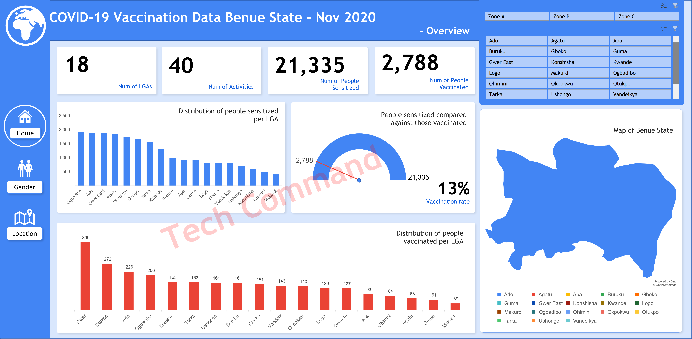

# ABOUT ME

Hello! I'm Timothy Bamisaye 🤓—a data analyst, educator, and consultant dedicated to transforming raw data into meaningful, actionable insights. With expertise spanning humanitarian efforts, sales, operations, and customer service, I specialize in helping businesses overcome challenges and achieve sustainable growth through data driven decision making.

# WHAT I DO

As the Lead Analyst of Tech Command, I provide consulting and training services for businesses and mentor aspiring analysts.

✅Data Analytics Consulting. I provide in-depth analysis and tailored solutions to help you make data-driven decisions, optimize processes, and drive business growth.

✅ Staff Training & Development. I offer comprehensive training programs in data analysis, visualization, and data-driven decision-making. From beginner to advanced levels.

# My Projects

Below are some of the projects I have worked on.

## Predictive Modelling and analysis of Titanic Dataset

	

The RMS Titanic popularly known as Titanic a British passenger liner was the world largest ship at the time, suffered one of the most infamous maritime disaster in history on her maiden voyage, leading to loss of lives. This project seeks to analyze factors that influence survival if any, and the chances of survival of the different passenger aboard the ship.
[Read More](COVID_Activity_Documentation.pdf)

## Tracking COVID-19 Sensitization and Vaccination Activity Data

	

COVID-19, a virus that ravaged the world in between 2019 and 2020. The pandemic spread rapidly like wildfire, infecting millions and causing widespread illness, death and economic disruption. To combat covid-19 in Nigeria, Life Abundance Int’l an NGO in Benue state is charged with the responsibility to sensitize people on symptom, prevention, and treatment of covid-19, while also providing vaccination services while encouraging those sensitized to get vaccinated as a means to stop the spread and reduce impact of COVID-19 if infected
[Read More](COVID_Activity_Documentation.pdf)

## Analyzing & Evaluating Sales Data

	

Sales a driving force behind every business, This model seeks to analyse and sales data from Lavida Stores to be able to identify trend and patterns, and overall chart ways to improve sales performance in subsequent years.
[Read More](COVID_Activity_Documentation.pdf)

# Want to Learn?

This course takes you from being a complete novice to a pro analyzing data using Excel and Power BI. A detailed step by step guide to help you become a professional data analyst
Get the Course

# Contact Me

|----------|----------|
| 📩   |   [your_email@gmail.com](mailto:your_email@gmail.com)  	   | 	<!-- replace your_email@gmail.com with your email address -->
| 📞   |   [your_phone_number](https://wa.me/2348060606060)  	   |	<!-- replace 2348060606060 with your phone number, remember to add your country code -->	
| 🗃️	| 	[View Resume](my_resume.pdf)				   |	<!-- replace with the name and extension of your resume -->
| 📺	|	[Your_Youtube_URL](https://www.example.com)	           | <!-- replace https://www.example.com with your youtube url -->

